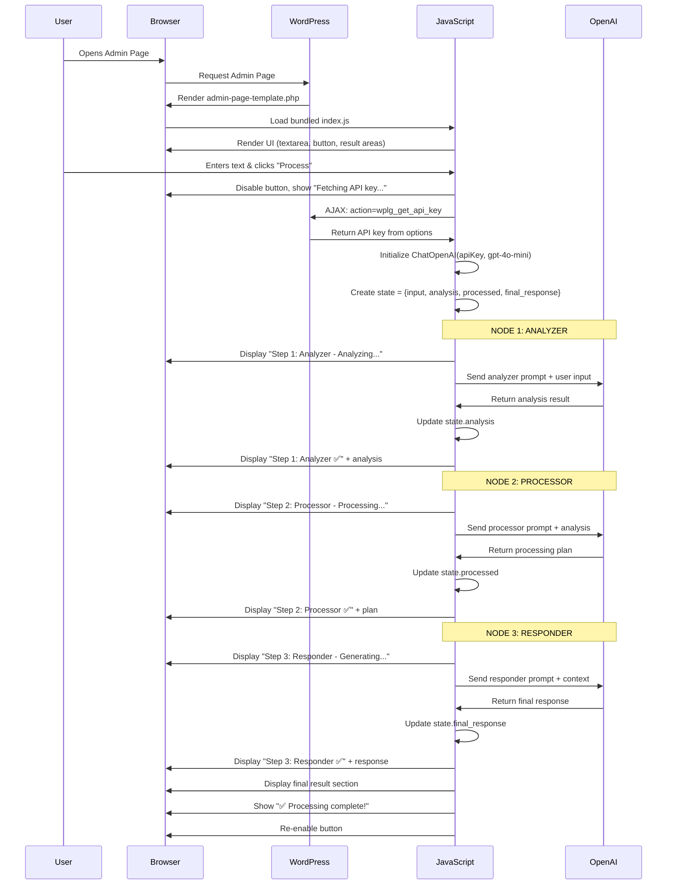
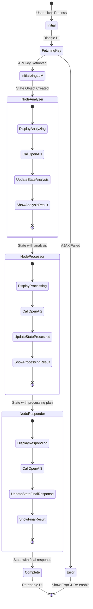
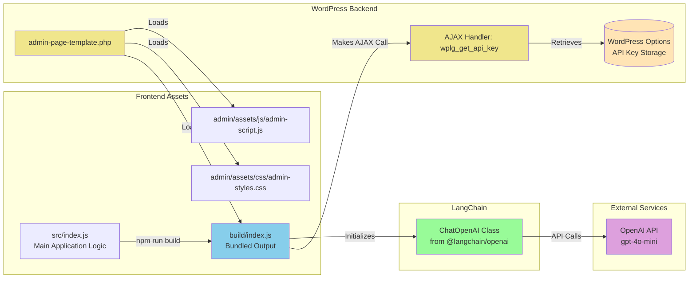

# LangGraph WordPress Plugin - Workflow Diagram

## System Architecture & Workflow

```mermaid
graph TB
    Start([User Opens Admin Page]) --> LoadUI[WordPress Admin Page Loads]
    LoadUI --> LoadJS[Load & Execute index.js Bundle]
    LoadJS --> RenderApp[Render Application UI]
    RenderApp --> WaitInput[Wait for User Input]
    
    WaitInput --> UserInput[User Enters Text & Clicks Process]
    UserInput --> Disable[Disable Button & Clear Results]
    Disable --> FetchKey[Fetch API Key via AJAX]
    
    FetchKey --> AJAX{AJAX Request<br/>to WordPress}
    AJAX -->|Success| GotKey[API Key Retrieved<br/>from WordPress Options]
    AJAX -->|Error| ShowError1[Display Error Message]
    ShowError1 --> End1([End - Re-enable Button])
    
    GotKey --> InitLLM[Initialize ChatOpenAI<br/>gpt-4o-mini Model]
    InitLLM --> CreateState[Create Initial State Object]
    
    CreateState --> StateBox["State = {<br/>input: user text,<br/>analysis: '',<br/>processed: '',<br/>final_response: '',<br/>step_count: 0<br/>}"]
    
    StateBox --> Node1[NODE 1: ANALYZER]
    
    %% NODE 1: ANALYZER
    Node1 --> Display1[Display: 'Analyzing...']
    Display1 --> Prompt1[Build Analyzer Prompt:<br/>- Identify main topic<br/>- Extract key points<br/>- Determine tone]
    Prompt1 --> API1[Call OpenAI API]
    API1 --> Update1[Update State:<br/>state.analysis = response<br/>state.step_count++]
    Update1 --> ShowStep1[Display Analysis Result ✅]
    
    ShowStep1 --> Node2[NODE 2: PROCESSOR]
    
    %% NODE 2: PROCESSOR
    Node2 --> Display2[Display: 'Processing...']
    Display2 --> Prompt2[Build Processor Prompt:<br/>- Review analysis<br/>- Create response plan<br/>- Structure format]
    Prompt2 --> API2[Call OpenAI API]
    API2 --> Update2[Update State:<br/>state.processed = response<br/>state.step_count++]
    Update2 --> ShowStep2[Display Processing Plan ✅]
    
    ShowStep2 --> Node3[NODE 3: RESPONDER]
    
    %% NODE 3: RESPONDER
    Node3 --> Display3[Display: 'Generating Response...']
    Display3 --> Prompt3[Build Responder Prompt:<br/>- Use analysis<br/>- Follow processing plan<br/>- Generate final answer]
    Prompt3 --> API3[Call OpenAI API]
    API3 --> Update3[Update State:<br/>state.final_response = response<br/>state.step_count++]
    Update3 --> ShowStep3[Display Final Response ✅]
    
    ShowStep3 --> ShowFinal[Display Final Result Section]
    ShowFinal --> Success[Show Success Message]
    Success --> Enable[Re-enable Process Button]
    Enable --> End2([End - Ready for Next Input])
    
    style Start fill:#90EE90
    style End1 fill:#FFB6C1
    style End2 fill:#90EE90
    style Node1 fill:#87CEEB
    style Node2 fill:#87CEEB
    style Node3 fill:#87CEEB
    style StateBox fill:#FFE4B5
    style API1 fill:#DDA0DD
    style API2 fill:#DDA0DD
    style API3 fill:#DDA0DD
```



## Detailed Component Flow



## State Management Flow



## File Structure & Responsibilities



## Key Concepts

### 1. **Graph-Style Workflow**
The plugin simulates LangGraph's StateGraph pattern but uses a simpler sequential approach that works in browsers:
- **Nodes**: Each step (Analyzer, Processor, Responder) is like a graph node
- **State**: A JavaScript object that flows through all nodes
- **Sequential Flow**: Each node receives state, processes it, updates it, and passes to next node

### 2. **State Object Structure**
```javascript
{
  input: "User's original text",
  analysis: "Results from Analyzer node",
  processed: "Results from Processor node", 
  final_response: "Results from Responder node",
  step_count: 3 // Tracks progress
}
```

### 3. **Node Pattern**
Each node follows the same pattern:
1. Display "Processing..." status
2. Build prompt using previous state + instructions
3. Call OpenAI API
4. Update state with response
5. Display "Complete ✅" with results
6. Pass updated state to next node

### 4. **Why Sequential (Not LangGraph StateGraph)?**
- **Browser Limitation**: LangGraph's StateGraph requires Node.js modules (async_hooks) that don't work in browsers
- **Same Result**: Sequential approach achieves the same workflow with state management
- **Simpler**: Easier to understand and maintain for WordPress context

### 5. **WordPress Integration**
- API key stored securely in WordPress options (not in code)
- AJAX endpoint to retrieve key at runtime
- Admin page in WordPress dashboard
- Uses WordPress scripts enqueue system

## Usage Flow

1. **Setup**: Admin saves OpenAI API key in "02 AGENT JS" settings
2. **Access**: Navigate to "30 LangGraph Demo" in WordPress admin
3. **Input**: Enter text in textarea (e.g., "Tell me about WordPress")
4. **Process**: Click "Process with Graph Workflow" button
5. **Watch**: See each step execute and display results:
   - Step 1: Analyzer analyzes the input
   - Step 2: Processor creates response plan
   - Step 3: Responder generates final answer
6. **Result**: View the comprehensive final response
7. **Repeat**: Enter new text and process again

## Technologies Used

- **Backend**: PHP (WordPress plugin system)
- **Frontend**: JavaScript (ES6+), bundled with webpack
- **AI**: OpenAI GPT-4o-mini via LangChain
- **Build**: @wordpress/scripts (npm package)
- **State Management**: Plain JavaScript objects
- **API**: WordPress AJAX API for backend communication
