# Understanding AI Agents: A Comprehensive Guide

## Introduction

An **AI Agent** represents a paradigm shift from traditional AI systems. Rather than simply responding to prompts, an AI agent can perceive its environment, make decisions, take actions, and work autonomously toward achieving specific goals. This document explores the fundamental concepts of AI agents, with particular relevance to their implementation in systems like WordPress.

---

## What is an AI Agent?

An AI agent is an AI system that can:

1. **Perceive** its environment through inputs and observations
2. **Reason** about what actions to take based on its goals
3. **Act** by using tools and functions to modify its environment
4. **Learn** from outcomes to improve future decisions
5. **Persist** information across interactions through memory systems

### Traditional AI vs. AI Agents

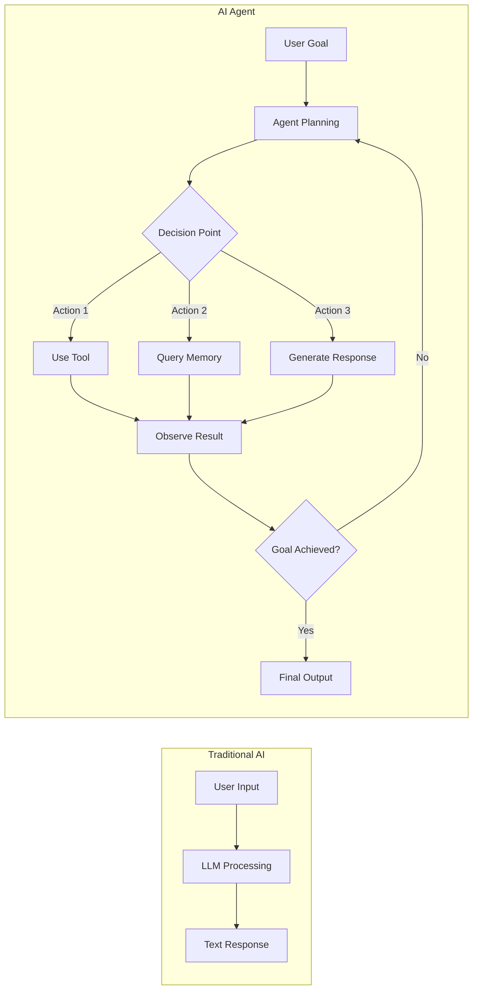

**Key Difference:** Traditional AI follows a linear input→process→output flow, while AI agents engage in iterative cycles of reasoning, action, and observation until goals are met.

---

## Core Components of AI Agents

### 1. The Reasoning Engine (LLM)

At the heart of an AI agent is a Large Language Model that serves as the "brain." This engine:

- Interprets user goals and context
- Plans sequences of actions
- Decides which tools to use and when
- Synthesizes information from multiple sources

### 2. Tool Calling (Function Calling)

Tool calling enables agents to interact with external systems and perform concrete actions beyond text generation.

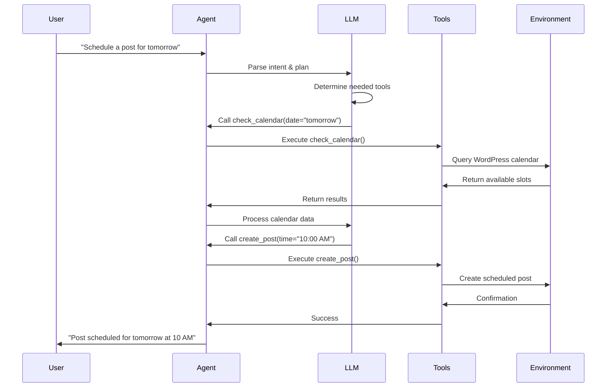

#### Tool Definition Structure

Tools are defined with schemas that specify:

- **Name:** Identifier for the tool
- **Description:** What the tool does (crucial for agent decision-making)
- **Parameters:** Required and optional inputs with types and descriptions
- **Return values:** What data the tool provides back

Example tool definition for WordPress:

```python
{
    "name": "create_wordpress_post",
    "description": "Creates a new blog post in WordPress with specified content and metadata",
    "parameters": {
        "title": {
            "type": "string",
            "description": "The post title",
            "required": True
        },
        "content": {
            "type": "string",
            "description": "The post content in HTML format",
            "required": True
        },
        "status": {
            "type": "string",
            "description": "Post status: draft, publish, or schedule",
            "required": False,
            "default": "draft"
        },
        "categories": {
            "type": "array",
            "description": "List of category IDs",
            "required": False
        }
    }
}
```

### 3. Memory Systems

Memory enables agents to maintain context, learn from interactions, and provide personalized experiences.

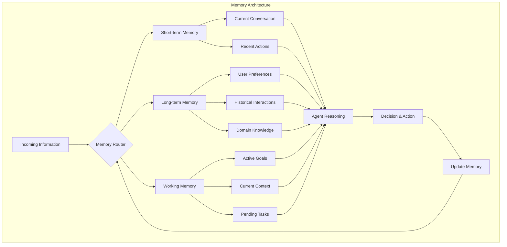

#### Types of Memory

**Short-term Memory (Conversation Buffer)**
- Stores the current conversation context
- Typically limited to recent messages
- Refreshed or cleared between sessions

**Long-term Memory (Persistent Storage)**
- User preferences and settings
- Historical interaction patterns
- Learned facts and relationships
- Retrieved when relevant to current task

**Working Memory (Task Context)**
- Active goals and sub-goals
- Intermediate results from tool calls
- Current state of multi-step processes

#### WordPress-Specific Memory Example

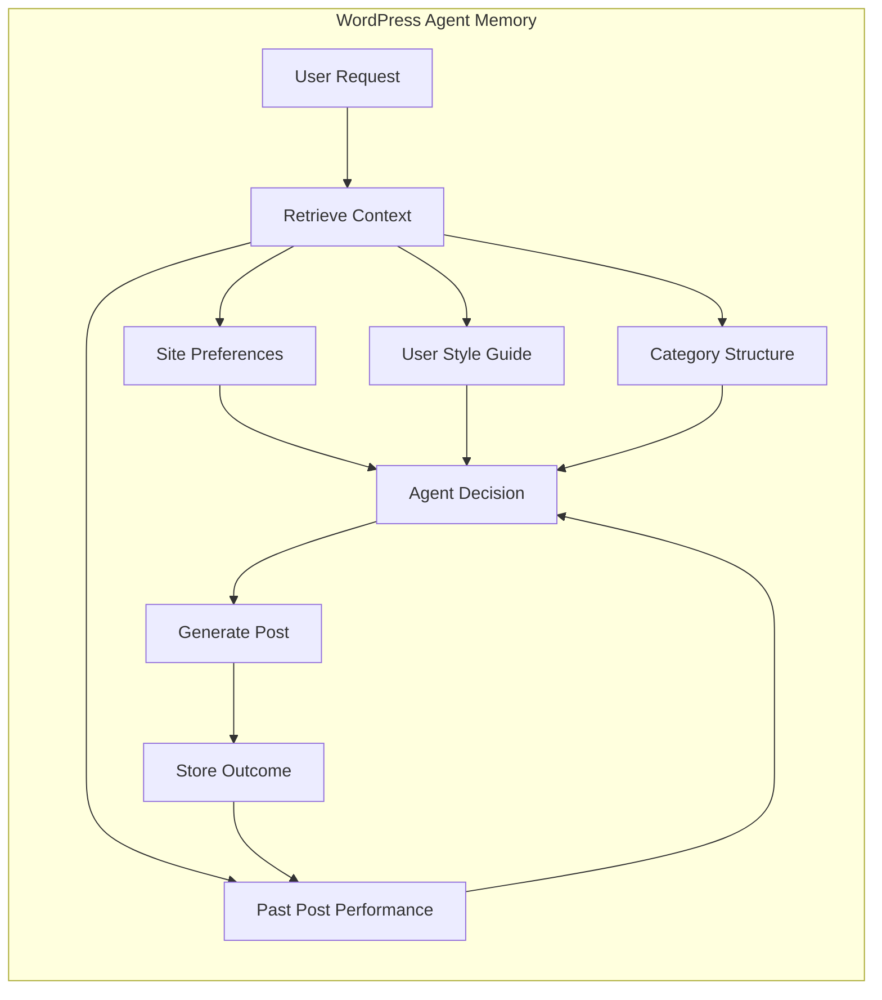

---

## Agentic Program Flow

Unlike traditional programs with fixed execution paths, agents follow **dynamic, goal-oriented flows** where the next action depends on the current state and reasoning.

### The Agent Loop

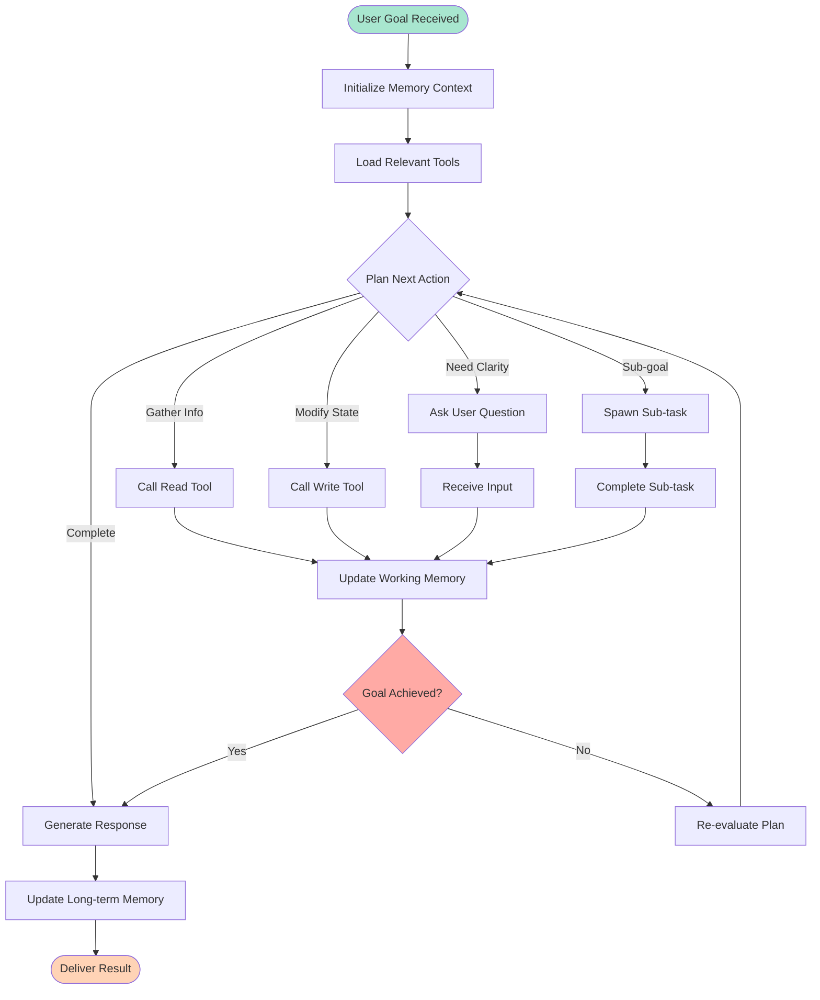

### Decision-Making Process

The agent's reasoning follows this general pattern:

1. **Goal Decomposition:** Break complex goals into manageable sub-goals
2. **Context Retrieval:** Pull relevant memory and information
3. **Action Selection:** Choose the most appropriate tool or response
4. **Execution:** Perform the action
5. **Observation:** Analyze the result
6. **Reflection:** Determine if progress was made toward the goal
7. **Adaptation:** Adjust the plan based on outcomes

### ReAct Pattern (Reasoning + Acting)

A popular framework for agent behavior:

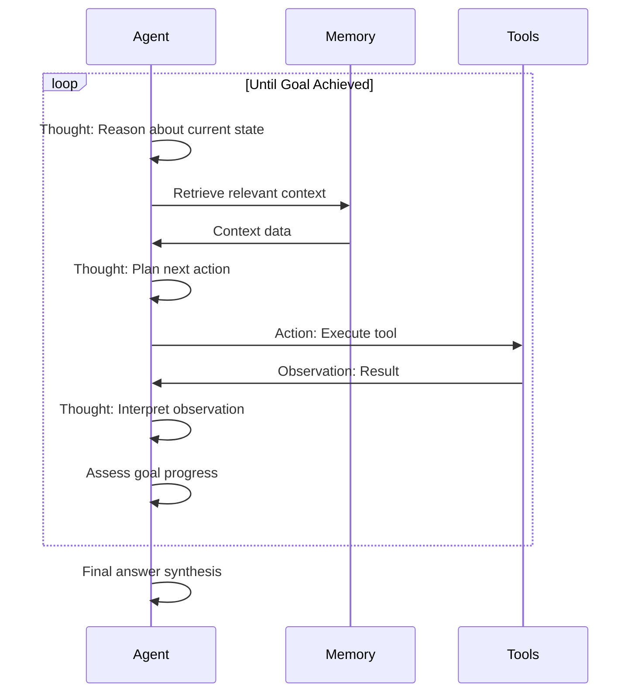

**Example ReAct trace for WordPress:**

```
Goal: Create an SEO-optimized blog post about "WordPress security"

Thought: I need to gather information about current WordPress security best practices
Action: search_knowledge_base(query="WordPress security best practices 2024")
Observation: Found 5 relevant articles with key topics: plugin updates, strong passwords, 
             SSL certificates, backups, and security plugins

Thought: I should check if there are existing posts on this topic to avoid duplication
Action: search_wordpress_posts(query="WordPress security")
Observation: Found 2 posts from 2022, both outdated

Thought: I'll create a comprehensive updated post. First, I should determine optimal keywords
Action: get_seo_keywords(topic="WordPress security", target_audience="small business owners")
Observation: Primary keyword: "WordPress security", Secondary: "secure WordPress site", 
             "WordPress security plugins", "WordPress hardening"

Thought: Now I can generate the post content with SEO optimization
Action: create_wordpress_post(
    title="Complete Guide to WordPress Security in 2024",
    content="[Generated optimized content]",
    meta_description="[SEO description]",
    keywords=["WordPress security", "secure WordPress site"],
    status="draft"
)
Observation: Post created successfully with ID 1234, status: draft

Thought: Goal achieved - created SEO-optimized post as requested
Final Answer: I've created a comprehensive blog post about WordPress security optimized for 
              SEO. The post is saved as a draft (ID: 1234) and ready for your review.
```

---

## Agentic Patterns in WordPress

### 1. Content Creation Agent

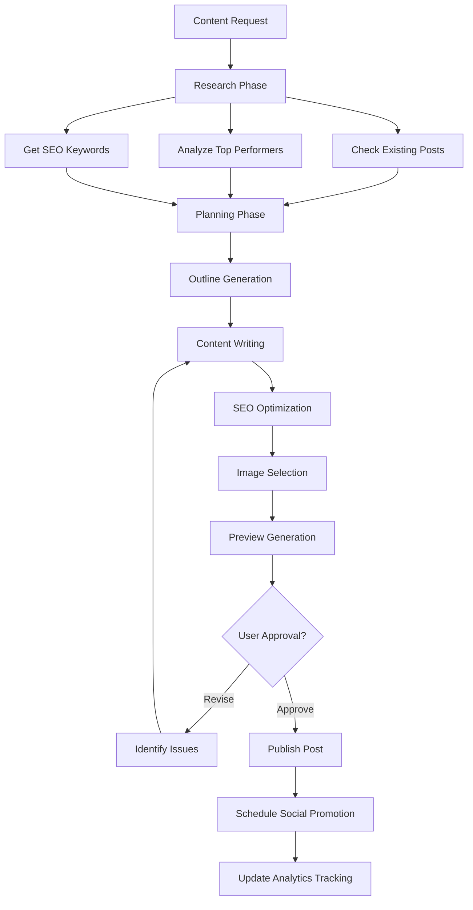

### 2. Site Maintenance Agent

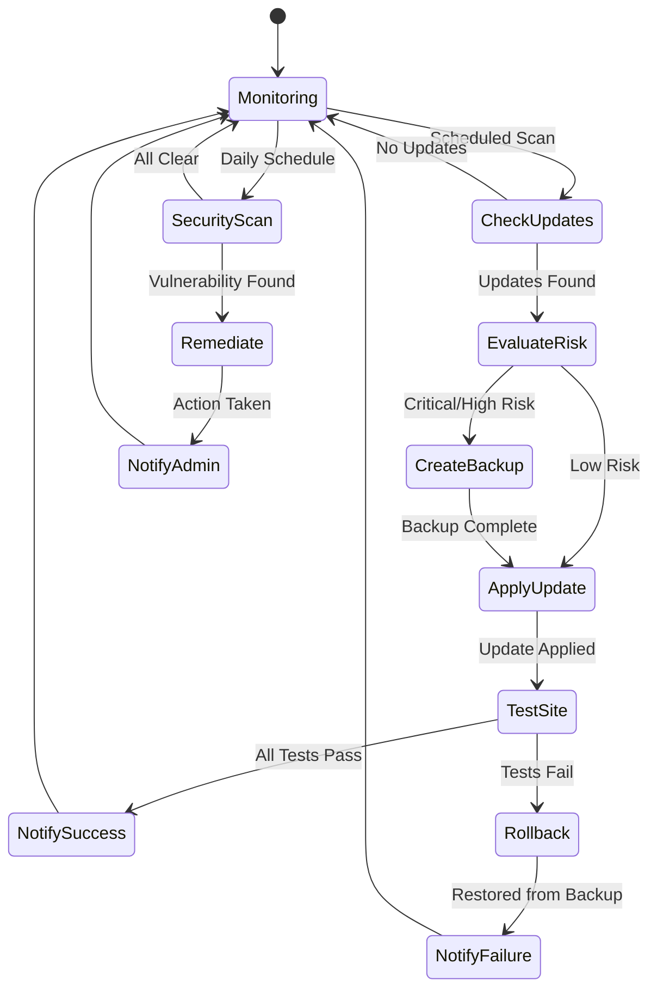

### 3. Customer Support Agent

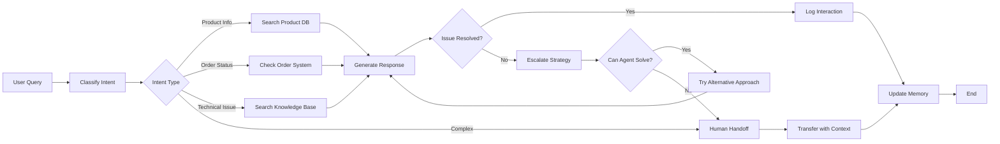

---

## Multi-Agent Systems

Complex tasks may require multiple specialized agents working together.

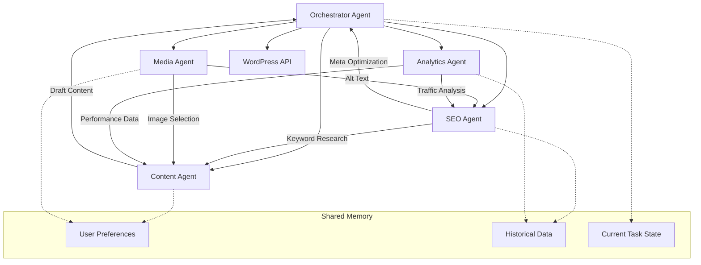

### Communication Patterns

**Hierarchical:** One orchestrator coordinates specialized agents
**Collaborative:** Agents work as peers, sharing information
**Sequential:** Agents work in pipeline fashion, passing results forward

---

## Memory Implementation Strategies

### Vector Storage for Semantic Memory

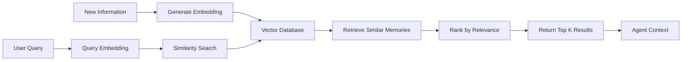

**Example WordPress Use Case:**

When a user asks to "create a post similar to my best performer," the agent:
1. Embeds the query
2. Searches vector DB of past posts
3. Retrieves the highest-performing similar posts
4. Analyzes their characteristics
5. Generates new content with similar patterns

### Structured Memory with Knowledge Graphs

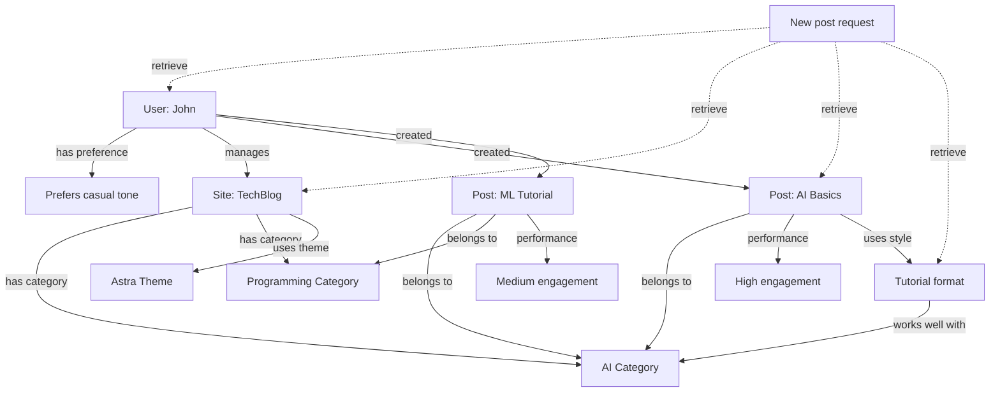

This structure allows the agent to reason: "John prefers casual tone, his tutorial-style posts in the AI category perform well, so I should use that format for this new AI post."

---

## Advanced Agentic Behaviors

### 1. Planning and Reflection

Agents can create plans before acting and reflect on outcomes:

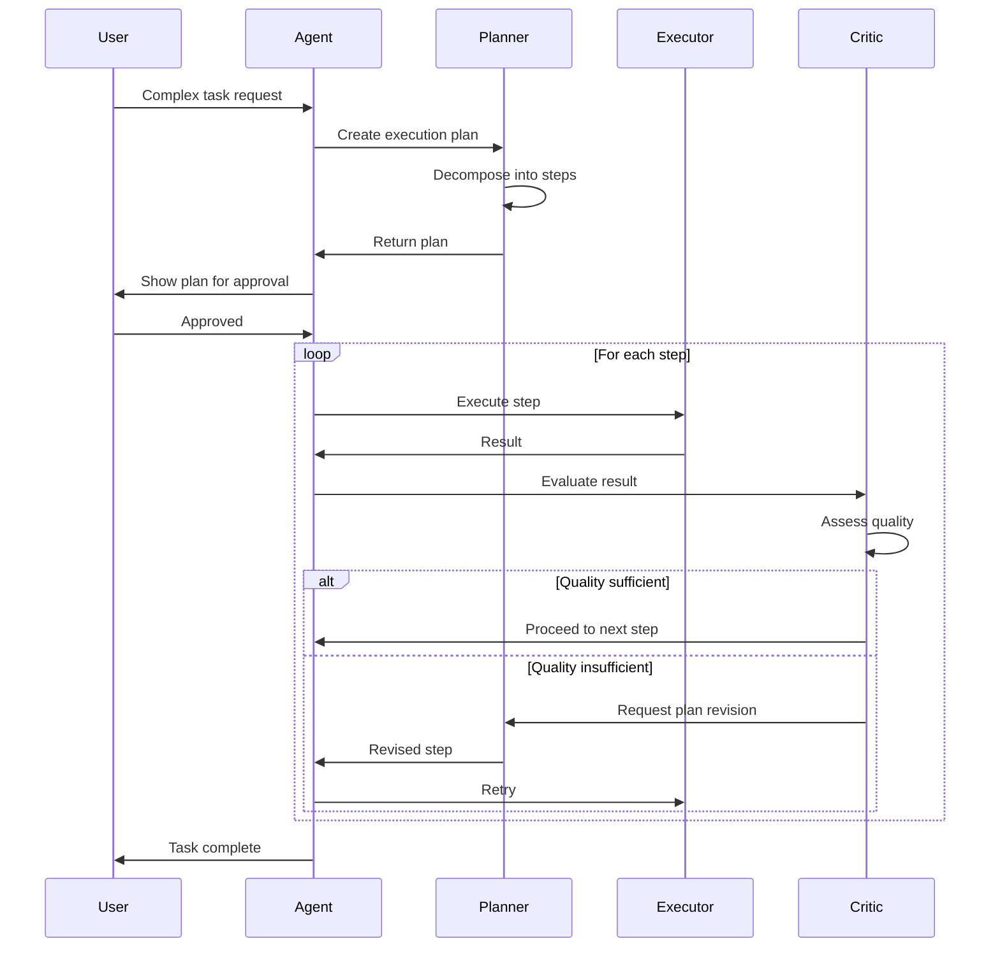

### 2. Self-Correction

Agents can detect and fix their own mistakes:

```python
# Pseudo-code for self-correcting agent behavior

def agent_with_self_correction(goal, max_attempts=3):
    for attempt in range(max_attempts):
        plan = create_plan(goal)
        result = execute_plan(plan)
        
        # Self-evaluation
        quality_score = evaluate_result(result, goal)
        
        if quality_score > threshold:
            return result
        else:
            # Reflect on what went wrong
            errors = identify_errors(result, goal)
            corrections = generate_corrections(errors)
            
            # Update approach
            goal = apply_corrections(goal, corrections)
            update_memory(errors, corrections)  # Learn from mistakes
    
    return best_attempt  # Return best result after max attempts
```

### 3. Human-in-the-Loop

Critical decisions can involve human oversight:

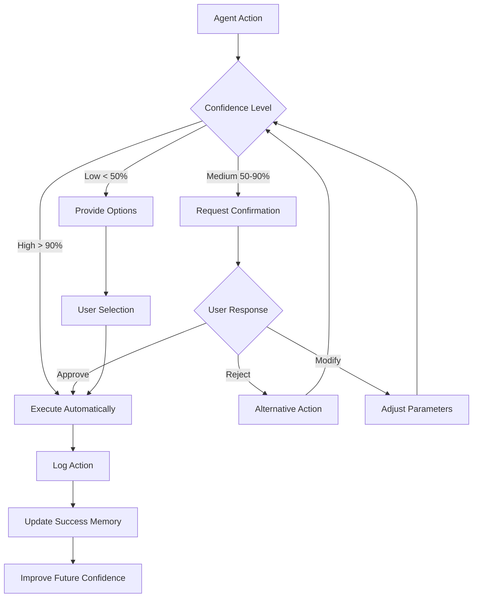

---

## Challenges and Considerations

### 1. Reliability and Error Handling

**Challenge:** Tool calls can fail, external systems may be unavailable

**Solutions:**
- Implement retry logic with exponential backoff
- Provide fallback strategies
- Graceful degradation when tools unavailable
- Clear error messages to users

### 2. Cost Management

**Challenge:** Agent loops can consume many API calls

**Solutions:**
- Set maximum iteration limits
- Cache repeated queries
- Use cheaper models for planning, expensive models for execution
- Implement early stopping when goals achieved

### 3. Context Window Limits

**Challenge:** Long conversations exhaust LLM context windows

**Solutions:**
- Summarize old conversation portions
- Selective memory retrieval (only load relevant context)
- Store detailed information externally, load summaries
- Use memory compression techniques

### 4. Security in WordPress Context

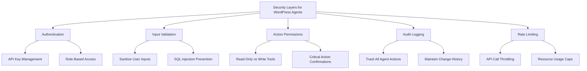

---

## Building Your First WordPress Agent

### Architecture Overview

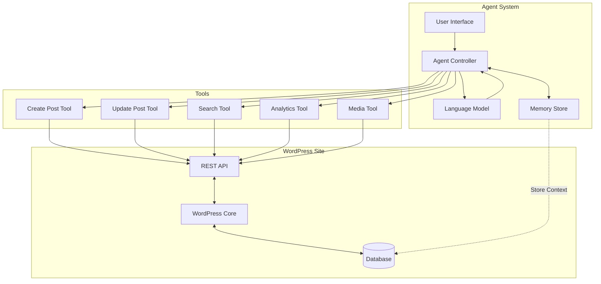

### Implementation Steps

1. **Define Your Agent's Purpose**
   - What specific WordPress tasks will it handle?
   - What are its boundaries and limitations?

2. **Design Your Tool Set**
   - Map WordPress REST API endpoints to tools
   - Create tool schemas with clear descriptions
   - Implement error handling

3. **Implement Memory**
   - Choose storage backend (database, vector DB)
   - Define what to remember (user preferences, site config, past actions)
   - Create retrieval mechanisms

4. **Build the Agent Loop**
   - Initialize with user goal
   - Implement reasoning cycle
   - Add tool calling logic
   - Handle results and iterations

5. **Add Safety Measures**
   - Confirm destructive actions
   - Validate inputs
   - Rate limit API calls
   - Log all actions

6. **Test and Iterate**
   - Start with simple tasks
   - Gradually add complexity
   - Monitor performance and costs
   - Refine based on user feedback

---

## Future Directions

### Emerging Capabilities

1. **Multimodal Agents:** Process images, audio, video alongside text
2. **Continuous Learning:** Agents that improve from every interaction
3. **Collaborative Agents:** Multiple agents working on shared goals
4. **Proactive Agents:** Anticipate needs rather than waiting for requests

### WordPress-Specific Evolution

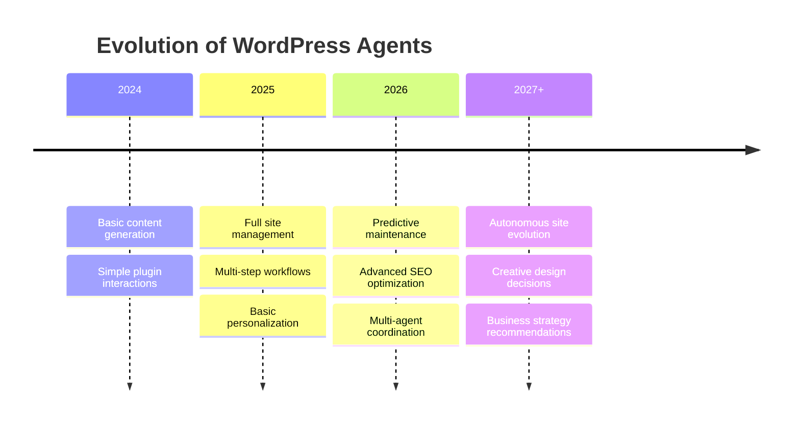

---

## Conclusion

AI agents represent a fundamental shift in how we interact with AI systems. By combining reasoning, tool use, memory, and autonomous decision-making, agents can handle complex, multi-step tasks that previously required human intervention at every stage.

For WordPress specifically, agents open possibilities for:
- Automated content creation and optimization
- Intelligent site maintenance
- Personalized user experiences
- Data-driven decision making
- 24/7 customer support

The key to successful agent implementation lies in:
1. Clear goal definition
2. Well-designed tool interfaces
3. Effective memory systems
4. Robust error handling
5. Human oversight for critical decisions

As the technology matures, we'll see agents become increasingly capable, handling more complex reasoning and longer-horizon planning while maintaining reliability and safety.

---

## Additional Resources

- **WordPress REST API Documentation:** Understanding the endpoints your agent will interact with
- **LangChain / LlamaIndex:** Popular frameworks for building agents
- **Vector Databases:** Pinecone, Weaviate, ChromaDB for semantic memory
- **Prompt Engineering:** Crafting effective system prompts for agents
- **ReAct Paper:** Foundational research on reasoning and acting in agents

---

## Glossary

**Agent Loop:** The cycle of reasoning → action → observation that agents use to accomplish goals

**Tool Calling:** The ability for an LLM to invoke external functions with structured parameters

**Memory Store:** Persistent storage of information that agents can retrieve and update

**ReAct Pattern:** A framework combining reasoning (thought) and acting (action) in alternating steps

**Working Memory:** Temporary storage of current task context and intermediate results

**Vector Embedding:** Mathematical representation of text/data for semantic similarity search

**Orchestrator:** An agent that coordinates multiple specialized sub-agents

**Human-in-the-Loop:** System design where humans provide oversight or input at key decision points