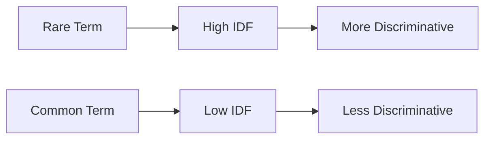

# BM25 and Information Retrieval: A Comprehensive Guide

## Introduction

BM25 (Best Matching 25) is one of the most effective and widely-used ranking functions in information retrieval. It's used by search engines to rank documents based on their relevance to a given query. Before diving into BM25, we need to understand its foundational concepts.

## TF (Term Frequency)

**Term Frequency** measures how often a term appears in a document. The intuition is simple: if a term appears many times in a document, that document is probably about that term.

### Raw Term Frequency

The simplest form is just counting:

```
TF(t, d) = count of term t in document d
```

**Example:**
- Document: "cat cat dog cat bird"
- TF("cat") = 3
- TF("dog") = 1

### Problem with Raw TF

Raw counts favor longer documents. A document with 1000 words might naturally contain a term more times than a 100-word document, even if both are equally relevant.

### Normalized Term Frequency

One solution is to normalize by document length:

```
TF(t, d) = (count of term t in document d) / (total terms in document d)
```

## IDF (Inverse Document Frequency)

**IDF** addresses a critical insight: not all terms are equally informative.

### The Problem IDF Solves

Consider searching for "the cat sat":
- "the" appears in almost every document
- "cat" appears in fewer documents
- "sat" appears in even fewer

The word "the" tells us almost nothing about relevance, while "cat" is much more discriminative.

### IDF Formula

```
IDF(t) = log(N / df(t))
```

Where:
- N = total number of documents
- df(t) = number of documents containing term t

### IDF Intuition



**Example:**
- Corpus: 10,000 documents
- "the" appears in 9,900 documents: IDF = log(10000/9900) ≈ 0.01
- "quantum" appears in 10 documents: IDF = log(10000/10) = 3.0

The logarithm serves two purposes:
1. Dampens the effect (linear scaling would be too extreme)
2. Makes rare terms valuable but not overwhelmingly so

### IDF Visualization

```
High IDF (Rare, Valuable)
│
│     quantum (10 docs)
│     ▲
│     │
│     │  neural (100 docs)
│     │  ▲
│     │  │
│     │  │    computer (1000 docs)
│     │  │    ▲
│     │  │    │
│     │  │    │      the (9900 docs)
│     │  │    │      ▲
└─────┴──┴────┴──────┴──────────────
Low IDF (Common, Less Valuable)
```

## TF-IDF: Combining TF and IDF

TF-IDF combines both concepts:

```
TF-IDF(t, d) = TF(t, d) × IDF(t)
```

This balances:
- **Term frequency**: How much is this term in THIS document?
- **Inverse document frequency**: How unique/informative is this term?

**Example:**

Document 1: "The cat sat on the mat. The cat was happy."
Document 2: "The dog played in the park. The dog was energetic."

Query: "cat"

For Document 1:
- TF("cat") = 2/10 = 0.2
- IDF("cat") = log(2/1) ≈ 0.693
- TF-IDF = 0.2 × 0.693 ≈ 0.139

For Document 2:
- TF("cat") = 0/10 = 0
- TF-IDF = 0

Document 1 ranks higher!

## BM25: Best Matching 25

BM25 is an improved version of TF-IDF that addresses its limitations. It was developed as part of the Okapi information retrieval system.

### Problems with TF-IDF

1. **Unbounded TF**: A term appearing 100 times shouldn't be 100x more important than appearing once
2. **No document length normalization**: Longer documents get unfairly penalized or favored
3. **Linear scaling**: The relationship between term frequency and relevance isn't linear

### BM25 Formula

```
BM25(d, q) = Σ IDF(qᵢ) × [f(qᵢ, d) × (k₁ + 1)] / [f(qᵢ, d) + k₁ × (1 - b + b × |d|/avgdl)]
```

Where:
- **d**: document
- **q**: query
- **qᵢ**: term i in the query
- **f(qᵢ, d)**: frequency of term qᵢ in document d
- **|d|**: length of document d (in words)
- **avgdl**: average document length in the collection
- **k₁**: term frequency saturation parameter (typically 1.2 - 2.0)
- **b**: length normalization parameter (typically 0.75)

### Breaking Down BM25

#### 1. IDF Component

BM25 uses a slightly modified IDF:

```
IDF(qᵢ) = log[(N - df(qᵢ) + 0.5) / (df(qᵢ) + 0.5)]
```

The +0.5 smoothing prevents edge cases and provides better behavior for rare terms.

#### 2. Term Frequency Saturation (k₁)

```
TF_saturated = [f(qᵢ, d) × (k₁ + 1)] / [f(qᵢ, d) + k₁]
```

This creates a saturation curve:

```
Relevance
│
│        ________________  (saturation)
│       /
│      /
│     /
│    /
│   /
│  /
│ /
│/
└────────────────────────> Term Frequency
0   5   10   15   20
```

**Intuition**: The first few occurrences of a term matter a lot, but after that, additional occurrences matter less and less.

**Example with k₁ = 1.2:**
- f = 1: TF_saturated = 1 × 2.2 / 2.2 = 1.0
- f = 2: TF_saturated = 2 × 2.2 / 3.2 ≈ 1.375
- f = 10: TF_saturated = 10 × 2.2 / 11.2 ≈ 1.964
- f = 100: TF_saturated = 100 × 2.2 / 101.2 ≈ 2.174

Notice how going from 1 to 2 occurrences gives a 37.5% boost, but going from 10 to 100 only gives about 10% boost.

#### 3. Document Length Normalization (b)

```
length_norm = 1 - b + b × (|d| / avgdl)
```

The parameter **b** controls how much we penalize longer documents:
- **b = 0**: No length normalization (all documents treated equally)
- **b = 1**: Full length normalization (linear penalty/reward)
- **b = 0.75**: (default) Partial normalization - a good middle ground

**Intuition:**
- Short documents: length_norm < 1 → boosts the score
- Average documents: length_norm ≈ 1 → no change
- Long documents: length_norm > 1 → penalizes the score

This prevents long documents from dominating simply because they contain more words.

### Complete BM25 Example

**Corpus:**
- Doc 1: "cat" (1 word)
- Doc 2: "cat cat dog" (3 words)
- Doc 3: "dog dog dog dog" (4 words)
- Average length: 2.67 words

**Query:** "cat"

**Parameters:** k₁ = 1.2, b = 0.75

**Step 1: Calculate IDF**
- N = 3 documents
- df("cat") = 2 documents contain "cat"
- IDF("cat") = log[(3 - 2 + 0.5) / (2 + 0.5)] = log(1.5 / 2.5) ≈ -0.51

**Step 2: Calculate BM25 for Doc 1**
- f("cat", Doc1) = 1
- |Doc1| = 1
- length_norm = 1 - 0.75 + 0.75 × (1/2.67) = 0.53

```
BM25(Doc1, "cat") = -0.51 × [1 × 2.2] / [1 + 1.2 × 0.53]
                  = -0.51 × 2.2 / 1.636
                  ≈ -0.69
```

**Step 3: Calculate BM25 for Doc 2**
- f("cat", Doc2) = 2
- |Doc2| = 3
- length_norm = 1 - 0.75 + 0.75 × (3/2.67) = 1.09

```
BM25(Doc2, "cat") = -0.51 × [2 × 2.2] / [2 + 1.2 × 1.09]
                  = -0.51 × 4.4 / 3.31
                  ≈ -0.68
```

**Step 4: Doc 3**
- f("cat", Doc3) = 0
- BM25(Doc3, "cat") = 0

**Ranking:** Doc 1 > Doc 2 > Doc 3

## Parameter Tuning

### k₁ (Term Frequency Saturation)

- **Low k₁ (0.5 - 1.0)**: Quick saturation, first occurrence matters most
- **Medium k₁ (1.2 - 1.5)**: Default, balanced approach
- **High k₁ (2.0+)**: Slower saturation, multiple occurrences matter more

**Use cases:**
- **Low k₁**: When first mention is usually sufficient (titles, abstracts)
- **High k₁**: When repetition indicates relevance (technical documents, keyword-heavy content)

### b (Length Normalization)

- **Low b (0 - 0.5)**: Less penalty for long documents
- **Medium b (0.75)**: Default, balanced
- **High b (1.0)**: Strong penalty for long documents

**Use cases:**
- **Low b**: When longer documents tend to be more comprehensive and valuable
- **High b**: When document length shouldn't influence relevance (equal-length documents)

## Practical Implementation Considerations

### 1. Query Term Weighting

For multi-term queries, each term contributes independently:

```
Query: "black cat"
BM25(d, q) = BM25(d, "black") + BM25(d, "cat")
```

### 2. Handling Missing Terms

If a query term doesn't appear in a document, that term contributes 0 to the score.

### 3. Negative IDF Values

When a term appears in more than half the documents, IDF can be negative. Some implementations set a floor:

```
IDF(t) = max(0, log[(N - df(t) + 0.5) / (df(t) + 0.5)])
```

### 4. Implementation in Python

Here's a simplified implementation:

```python
import math
from collections import Counter

def bm25_score(query_terms, document, corpus, k1=1.2, b=0.75):
    # Calculate average document length
    avgdl = sum(len(doc.split()) for doc in corpus) / len(corpus)
    
    # Document length
    doc_len = len(document.split())
    
    # Term frequencies in document
    doc_terms = document.split()
    term_freq = Counter(doc_terms)
    
    score = 0.0
    N = len(corpus)
    
    for term in query_terms:
        # Calculate document frequency
        df = sum(1 for doc in corpus if term in doc.split())
        
        if df == 0:
            continue
            
        # IDF
        idf = math.log((N - df + 0.5) / (df + 0.5))
        
        # Term frequency in current document
        f = term_freq.get(term, 0)
        
        # BM25 formula
        numerator = f * (k1 + 1)
        denominator = f + k1 * (1 - b + b * (doc_len / avgdl))
        
        score += idf * (numerator / denominator)
    
    return score
```

## BM25 vs TF-IDF

| Aspect | TF-IDF | BM25 |
|--------|--------|------|
| **TF Growth** | Linear | Logarithmic (saturating) |
| **Length Norm** | Simple division | Tunable with b parameter |
| **Rare Terms** | Linear IDF | Smoothed IDF |
| **Parameters** | None | k₁ and b (tunable) |
| **Performance** | Good baseline | Generally superior |

## When to Use BM25

**BM25 excels at:**
- Full-text search engines
- Document retrieval systems
- Question answering systems
- Any task where ranking documents by relevance matters

**Consider alternatives when:**
- You need semantic understanding (use embeddings/neural IR)
- Documents are very short (simpler methods may suffice)
- Real-time constraints are extreme (though BM25 is quite fast)

## BM25 Variants

### BM25+

Addresses a problem where BM25 can assign negative scores:

```
BM25+(d, q) = Σ IDF(qᵢ) × [δ + (f(qᵢ, d) × (k₁ + 1)) / (f(qᵢ, d) + k₁ × (1 - b + b × |d|/avgdl))]
```

Where δ is a small constant (often 1).

### BM25L

Uses average term frequency instead of document length for normalization, which can be more robust for certain document types.

## Modern Context

While neural models and embeddings have gained popularity, BM25 remains relevant:

1. **Hybrid Systems**: Many modern search systems combine BM25 with neural re-ranking
2. **Fast and Interpretable**: BM25 is computationally efficient and explainable
3. **Strong Baseline**: Often hard to beat for lexical matching
4. **Few-shot Learning**: Doesn't require training data like neural models

## Summary

**Key Takeaways:**

1. **IDF** makes rare terms more valuable than common ones
2. **TF** captures how much a document is "about" a term
3. **BM25** improves on TF-IDF with:
   - Term frequency saturation (diminishing returns)
   - Tunable document length normalization
   - Better behavior for edge cases
4. **Parameters** k₁ and b allow tuning for your specific use case
5. **Still relevant** in modern IR systems, often combined with neural methods

BM25's elegance lies in its simplicity and effectiveness – it captures fundamental insights about information retrieval in a computationally efficient formula that has stood the test of time.