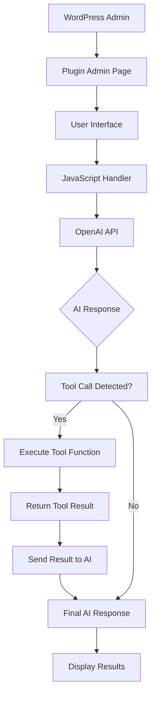
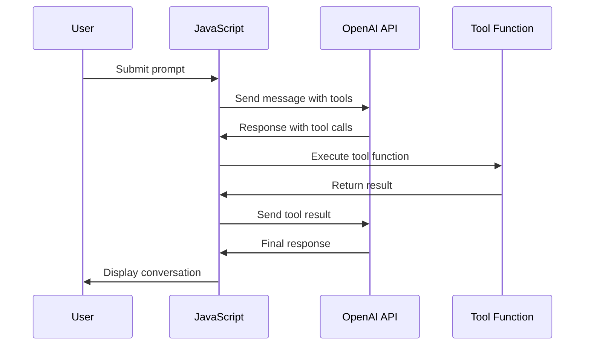

# OpenAI Tool Calling Demo Plugin

A WordPress plugin that demonstrates OpenAI's tool calling functionality through an interactive admin interface. This plugin showcases how AI models can call predefined functions (tools) to perform specific tasks and return results.

## 📋 Table of Contents

- [Overview](#overview)
- [Features](#features)
- [Architecture](#architecture)
- [Installation](#installation)
- [Usage](#usage)
- [Technical Implementation](#technical-implementation)
- [API Reference](#api-reference)
- [Examples](#examples)
- [Troubleshooting](#troubleshooting)

## 🎯 Overview

This plugin provides a WordPress admin page where users can interact with OpenAI's GPT models using tool calling capabilities. Tool calling allows AI models to execute predefined functions and use their results to provide more accurate and context-aware responses.

The demo includes two example tools:
- **`get_weather()`** - Returns mock weather information
- **`get_sum(a, b)`** - Calculates the sum of two numbers

## ✨ Features

- **Interactive Admin Interface**: Clean, modern UI integrated into WordPress admin
- **Real-time Tool Execution**: Live demonstration of tool calling with visual feedback
- **Multiple Tool Support**: Demonstrates handling different types of tools with varying parameters
- **Error Handling**: Comprehensive error handling for API failures and invalid inputs
- **Responsive Design**: Mobile-friendly interface with custom styling
- **Security**: Proper WordPress hooks and sanitization

## 🏗️ Architecture



### Component Breakdown

- **PHP Plugin File**: WordPress plugin bootstrap, admin menu registration, asset enqueuing
- **JavaScript Module**: Handles API communication, tool execution, and UI updates
- **CSS Styling**: Modern, gradient-based design with animations
- **Tool Functions**: Mock implementations of weather and calculation services

## 📦 Installation

1. **Download the plugin files** to your WordPress `wp-content/plugins/` directory
2. **Activate the plugin** through the WordPress admin dashboard
3. **Navigate to the demo page**: WordPress Admin → OpenAI Tool Demo

### File Structure

```
wp-openai-tool-calling-demo/
├── wp-openai-tool-calling-demo.php  # Main plugin file
├── js/
│   └── frontend.js                  # JavaScript functionality
└── css/
    └── frontend.css                 # Styling and animations
```

## 🚀 Usage

### Accessing the Demo

1. Log into your WordPress admin dashboard
2. Navigate to **"OpenAI Tool Demo"** in the admin menu
3. Enter your OpenAI API key
4. Type a prompt that would trigger tool usage
5. Click **"Send Request"** or press Enter

### Example Prompts

- "What's the weather like?"
- "What is 5 + 3?"
- "Can you tell me the weather and calculate 10 + 15?"

## 🔧 Technical Implementation

### Tool Calling Flow



### Key Technical Concepts

#### 1. Tool Definition Format

Tools must be defined in OpenAI's expected format:

```javascript
const tools = [
    {
        type: 'function',
        function: {
            name: 'tool_name',
            description: 'Tool description',
            parameters: {
                type: 'object',
                properties: {
                    param_name: {
                        type: 'string|number',
                        description: 'Parameter description'
                    }
                },
                required: ['param_name']
            }
        }
    }
];
```

#### 2. Tool Execution Loop

The implementation uses a loop to handle multiple tool calls:

```javascript
let continueLoop = true;
while (continueLoop && iterations < maxIterations) {
    // Send request to OpenAI
    // Process tool calls if present
    // Continue until no more tools or max iterations reached
}
```

#### 3. Message Format

Messages follow OpenAI's conversation format:

```javascript
const messages = [
    { role: 'user', content: userPrompt },
    { role: 'assistant', content: '...', tool_calls: [...] },
    { role: 'tool', tool_call_id: '...', content: '...' }
];
```

## 📚 API Reference

### JavaScript Functions

#### `handleToolCalling(apiKey, userPrompt)`

Main function that orchestrates the tool calling process.

**Parameters:**
- `apiKey` (string): OpenAI API key
- `userPrompt` (string): User's input prompt

#### `processToolCall(toolName, toolInput)`

Executes the appropriate tool function based on the tool name.

**Parameters:**
- `toolName` (string): Name of the tool to execute
- `toolInput` (object): Parameters for the tool

**Returns:** Tool execution result (string)

#### `displayMessage(type, content)`

Displays a message in the results area with appropriate styling.

**Parameters:**
- `type` (string): Message type ('loading', 'error', 'tool-call', 'tool-result', 'assistant-message')
- `content` (string): HTML content to display

### Tool Functions

#### `get_weather()`

Returns mock weather information.

**Returns:** `"The current weather is 25°C, sunny with a light breeze."`

#### `get_sum(a, b)`

Calculates the sum of two numbers.

**Parameters:**
- `a` (number): First number
- `b` (number): Second number

**Returns:** `"The sum of {a} and {b} is {result}."`

## 💡 Examples

### Example 1: Weather Query

**User Prompt:** "What's the weather?"

**AI Response:** (Tool call to get_weather)
**Tool Result:** "The current weather is 25°C, sunny with a light breeze."
**Final Response:** "The current weather is 25°C, sunny with a light breeze."

### Example 2: Math Calculation

**User Prompt:** "What is 5 + 3?"

**AI Response:** (Tool call to get_sum with a=5, b=3)
**Tool Result:** "The sum of 5 and 3 is 8."
**Final Response:** "The sum of 5 and 3 is 8."

### Example 3: Multiple Tools

**User Prompt:** "What's the weather and what is 10 + 15?"

**AI Response:** (Multiple tool calls: get_weather and get_sum)
**Tool Results:** Weather info and calculation result
**Final Response:** "The weather is 25°C, sunny with a light breeze, and 10 + 15 equals 25."

## 🎨 UI Components

### Message Types

The interface displays different types of messages with distinct styling:

- **Loading**: Yellow gradient, shows API call in progress
- **Error**: Red gradient, displays error messages
- **Tool Call**: Blue gradient, shows tool name and arguments
- **Tool Result**: Green gradient, displays tool execution results
- **Assistant Message**: Purple gradient, shows AI responses

### Styling Features

- Gradient backgrounds for visual appeal
- Smooth animations and transitions
- Custom scrollbar styling
- Responsive design elements
- Font integration (Raleway, Fira Code)

## 🔒 Security Considerations

- API keys are handled client-side (not stored server-side)
- No data persistence in WordPress database
- Proper WordPress action hooks usage
- Input validation for required fields

## 🐛 Troubleshooting

### Common Issues

**"Invalid API key" error**
- Verify your OpenAI API key is correct and active
- Ensure the key starts with "sk-"

**"No tool calls detected"**
- Try prompts that clearly request weather or calculations
- Check browser console for additional error details

**Plugin not appearing in admin menu**
- Ensure the plugin is activated
- Check for PHP errors in server logs

**Styling issues**
- Verify CSS and JS files are properly enqueued
- Check for plugin conflicts

### Debug Information

Enable WordPress debug mode to see additional error information:

```php
define('WP_DEBUG', true);
define('WP_DEBUG_LOG', true);
```

## 🚀 Future Enhancements

Potential improvements for the plugin:

- **Additional Tools**: Database queries, file operations, API integrations
- **Tool Management**: Admin interface for adding/removing tools
- **Conversation History**: Persistent chat history storage
- **Multiple Models**: Support for different OpenAI models
- **Batch Processing**: Handle multiple prompts simultaneously
- **Analytics**: Track tool usage and performance metrics

## 📄 License

This plugin is licensed under the GPL v2 or later.

## 🤝 Contributing

Contributions are welcome! Please feel free to submit pull requests or open issues for bugs and feature requests.

## 📞 Support

For support and questions:
- Check the WordPress plugin repository
- Review OpenAI's tool calling documentation
- Open an issue in the project repository

---

*This documentation was generated for the wp-openai-tool-calling-demo plugin. Last updated: January 2026*
